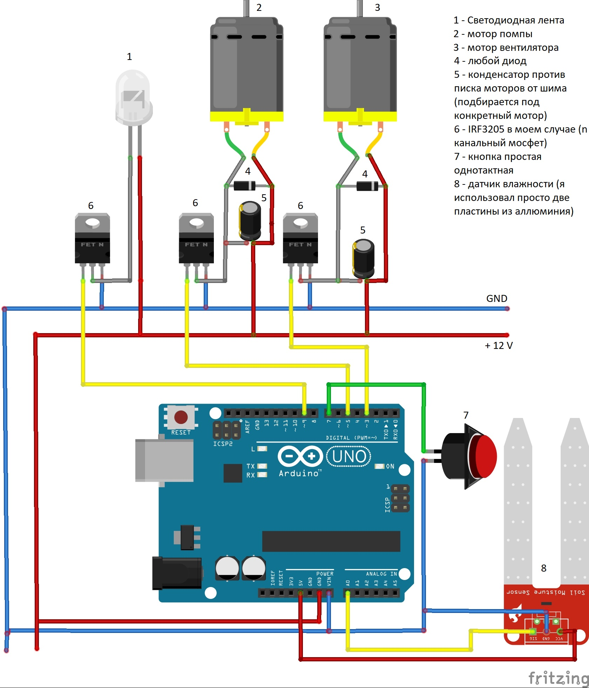

# Система автополива растений на плате Ардуино

*Система предназначена для осуществления качественного полива растений*

## Физическая часть:

- платформа Ардуино
- две аллюминиевые пластины 10х50мм (датчик влажности)
- компрессор для осуществления полива
- фито освещение
- вентилятор (устанавливается для использования в теплице)
- три управляемых ключа (мосфет транзисторы или реле)

## Возможности системы:

1. Полив и освещение включаются только в дневное время суток благодаря простой реализации настраиваемых программных часов
2. Реализована возможность отладки через Serial командами
	- "а" - запустить компрессор
	- "t" - установить время. формат чч:мм
	- "sgom" - установить время начала освещения
	- "sgon" - установить время конца освещения
	- "swel" - установить лимит влажности
	- "swai" - установить интервал полива
	- "spul" - установить длительность полива
3. Реализовано уплавление вентиляцией по средствам аппаратного ШИМа ардуино и мосфет транзистора.

## Дополнительная инфрмация:
- Диод на схеме нужен для гашения индуктивных всплесков от моторов
- Для увеличения или уменьшения скорости вентилятора нужно длительно зажать кнопку изображенную на схеме. При однократном нажатии на кнопку, в serial выводится информация о сохраненных переменных. Так же при этом переменные в памяти обновляются, это нужно для сохранения текущего времени, так как при подключении к ардуино через USB плата может перезагрузиться, и при включении, из памяти выгрузятся старые значения и время может сбиться. Поэтому перед подключением адруино следует коротко нажать на кнопку, о успешном обновлении переменных в памяти будет свидетельствовать светодиод на плате подключеный к 13 пину.

